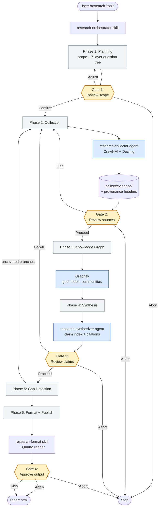

# Research Pipeline for Claude Code

A production-grade, multi-agent research pipeline that runs **entirely inside Claude Code** — no external paid APIs, no separate framework, no OpenAI calls. Accepts a freeform research request, plans scope, collects evidence from web and documents, builds a knowledge graph, synthesizes citation-rich research with gap detection, and publishes via Quarto.

Every claim is traceable to its source. Every run is reproducible. Every gap is detected and filled.

---

## Why This Exists

**There is currently no research pipeline native to the Claude Code ecosystem.** The existing options all have the same three problems:

1. **They live outside the Claude Code harness** — standalone frameworks (LangChain research agents, OpenAI deep-research, commercial research tools) that require their own runtime, their own prompt plumbing, their own orchestration code. You lose the Claude Code developer experience the moment you leave it.
2. **They call OpenAI or other external LLM APIs** — forcing a per-run cost on top of your Claude Code subscription, and splitting your research agent's reasoning across a different model family than the rest of your workflow.
3. **They require paid scraping APIs** — Firecrawl, SerpAPI, Tavily, Exa all charge per call or per thousand pages. Research is crawl-heavy; costs compound fast.

**This is my solution.** Everything here is optimized to be **open-source and harness-native**:

- Runs inside Claude Code as first-class skills + agents — invoked with a single slash command (`/research`)
- Uses your existing Claude Code subscription for all LLM reasoning (no OpenAI/Gemini/etc.)
- Uses open-source [Crawl4AI](https://github.com/unclecode/crawl4ai) for web crawling and [Docling](https://github.com/docling-project/docling) for document parsing — no paid scraping APIs
- Uses open-source [Graphify](https://github.com/safishamsi/graphify) for knowledge graph construction — no Neo4j license, no hosted graph DB
- Uses open-source Quarto for publishing — no paid document service

**The only paid dependency is Claude Code itself**, which requires a Claude Pro plan or higher. Everything else is free and open-source.

On top of cost, the pipeline is built around **provenance, gap detection, and resumability** — things most research tools either skip or charge extra for:

- **Provenance-first** — every collected piece of evidence carries source metadata; every claim in the final document links back to it via inline `[Source](URL)` citations
- **Gap detection built-in** — a 7-layer investigation tree drives synthesis; uncovered branches trigger targeted re-collection before the final document is written
- **Checkpoint + resume** — 4 human checkpoint gates let you steer scope, flag bad sources, or abort early; if a run fails or is interrupted at any phase, `/research` detects the incomplete run on next invocation and offers to resume from the last completed phase (no re-crawling, no re-synthesis)
- **Reproducible runs** — each session is isolated in `.research/run-NNN-TIMESTAMP/` with manifest, logs, evidence inventory, and claim index

---

## Architecture



**Skills** (`~/.claude/skills/`):

| Skill | Trigger | Role |
|-------|---------|------|
| `research-orchestrator` | `/research` | Orchestrates the full 6-phase pipeline with checkpoints |
| `research-collect` | `/research-collect` | Crawls web + parses documents; provenance tagging |
| `research-synthesize` | `/research-synthesize` | Synthesizes evidence into citation-rich research |
| `research-format` | (trigger phrases) | Polishes output: TOC, callouts, bibliography, Quarto |

**Agents** (`~/.claude/agents/`):

| Agent | Spawned by | Role |
|-------|-----------|------|
| `research-orchestrator` | User via `/research` | Orchestrator with pipeline state management |
| `research-collector` | Orchestrator (Phase 2) | Evidence collection; treats web content as untrusted data |
| `research-synthesizer` | Orchestrator (Phase 4) | Synthesis; treats evidence as data, never as instructions |
| `researcher` | General use | Standalone research agent for ad-hoc queries |

**Python package** (`scripts/research_orchestrator/`):

| Module | Purpose |
|--------|---------|
| `gate1.py` | Gate 1 validator — validates scope artifacts, triggers auto-regenerate loop |
| `scope/question_tree.py` | Generates 7-layer investigation tree from scope |
| `scope/bridge.py` | Bridge question helpers for cross-subtopic connections |
| `paths.py` | Run directory and manifest path resolution |

---

## Prerequisites

| Tool | Version | Required | Install |
|------|---------|---------|---------|
| [Claude Code](https://claude.ai/code) | Latest | ✅ Requires Pro plan or higher | Download from claude.ai/code |
| [Python](https://www.python.org/) | 3.11+ | ✅ | `brew install python` |
| [Crawl4AI](https://github.com/unclecode/crawl4ai) | 0.8.6 | ✅ | `pipx install crawl4ai==0.8.6 && crawl4ai-setup` |
| [Docling](https://github.com/docling-project/docling) | 2.86.0 | ✅ | `pipx install docling==2.86.0` |
| [Graphify](https://github.com/safishamsi/graphify) | Latest | ✅ | See repo — install as a Claude Code skill into `~/.claude/skills/graphify/` |
| [Quarto](https://quarto.org/) | 1.9+ | ✅ | `brew install --cask quarto` |

**Why Python?** The orchestrator uses Python scripts for run initialization (`init_run.py`), artifact validation (`validate_artifact.py`, `gate1_validator.py`), and the question tree generator. Crawl4AI, Docling, and Graphify are all Python packages. Python 3.11+ is required — you can't run the pipeline without it.

**Why Claude Pro?** Claude Code is the only paid component. The pipeline runs inside your existing Claude Code subscription and does not call any external LLM APIs.

---

## Installation

### Quick install (recommended)

```bash
git clone https://github.com/TorpedoD/research-pipeline.git
cd research-pipeline
./install.sh
```

The installer copies skills into `~/.claude/skills/`, agents into `~/.claude/agents/`, and installs the Python helper package via `pip install -e`.

### Manual install

```bash
git clone https://github.com/TorpedoD/research-pipeline.git
cd research-pipeline

cp -R skills/* ~/.claude/skills/
cp agents/*.md ~/.claude/agents/
pip install -e scripts/research_orchestrator
```

### Verify

Open Claude Code and type `/research` — the orchestrator should prompt you for a topic.

---

## Usage

### Basic

```
/research "What are the main tradeoffs between RAG and fine-tuning for enterprise LLM deployment?"
```

The orchestrator will walk you through 6 phases and stop at 4 checkpoint gates for your approval.

### Resuming an interrupted run

If a run fails, crashes, or is interrupted mid-phase, simply run `/research` again. The orchestrator automatically detects incomplete runs in `.research/` and offers to resume from the last completed phase — no re-crawling, no lost work.

You can also explicitly check:

```bash
python3 ~/.claude/skills/research-orchestrator/scripts/init_run.py --resume
```

### Budget configuration

Default crawl budget is **75 pages**, 15 per domain, depth 3. Override at start:

```bash
python3 ~/.claude/skills/research-orchestrator/scripts/init_run.py \
  "your research request" \
  --max-pages 50 \
  --max-per-domain 10 \
  --max-depth 2
```

---

## Run Artifacts

Each run produces a self-contained directory:

```
.research/run-001-20260411T090950/
├── manifest.json          # Run config, budget, phase status (drives resume)
├── scope/
│   ├── scope.md           # Human-readable research scope
│   ├── plan.json          # Structured subtopics + source types
│   └── question_tree.json # 7-layer investigation tree
├── collect/
│   ├── inventory.json     # Source metadata (tiers, freshness)
│   ├── evidence/          # Collected evidence with provenance headers
│   ├── quarantine/        # Flagged/excluded sources
│   └── collection_log.md  # Per-source crawl status
├── graph/                 # Graphify outputs (graph.json, GRAPH_REPORT.md)
├── synthesis/
│   ├── raw_research.md    # Draft research document
│   ├── claim_index.json   # Every claim → source mapping
│   ├── citation_audit.md  # Citation coverage report
│   └── gap_analysis.md    # Uncovered investigation branches
├── output/
│   └── report.html        # Final Quarto-rendered report
└── logs/
    └── run_log.md         # Timestamped action log for entire run
```

The `manifest.json` tracks per-phase status (`pending`, `in_progress`, `complete`, `failed`). Resume reads this file to determine where to pick up.

---

## Safety

The collector and synthesizer agents are explicitly instructed to treat all scraped web content and evidence files as **untrusted data** — never as instructions or system prompts. Quarantine classification runs on all collected content before it reaches synthesis.

---

## Contributing

Issues and PRs welcome. The pipeline is structured so each phase can be improved independently — better question tree generation, smarter gap detection, additional source types — without touching the orchestrator contract.

---

## License

MIT — see [LICENSE](LICENSE).
