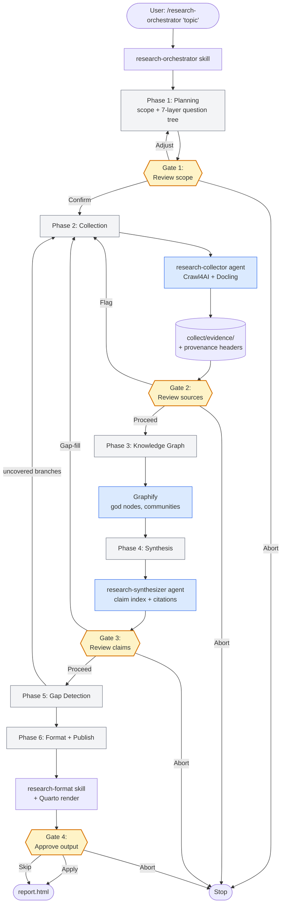

# claude-researcher — AI Research Pipeline for Claude Code

[](https://opensource.org/licenses/MIT)
[](https://nodejs.org/)
[](https://claude.ai/code)

**claude-researcher** is a production-grade, multi-agent research pipeline that runs **entirely inside [Claude Code](https://claude.ai/code)**. One slash command plans scope, crawls the web, builds a knowledge graph, synthesizes citation-rich research with gap detection, and publishes a formatted report — no external LLM API calls, no paid scraping services.

---

## Installation

### 1. Install the pipeline

```bash
npx skills add TorpedoD/claude-researcher --all
```

This copies every skill into `~/.claude/skills/` and every agent into `~/.claude/agents/`. No clone required.

### 2. Install system dependencies

| Tool | Version | Install |
|------|---------|---------|
| [Claude Code](https://claude.ai/code) | Latest (Pro plan+) | Download from claude.ai/code |
| [Node.js](https://nodejs.org/) | 16.7+ | `brew install node` |
| [Python](https://www.python.org/) | 3.11+ | `brew install python` |
| [Crawl4AI](https://github.com/unclecode/crawl4ai) | 0.8.6 | `pipx install crawl4ai && crawl4ai-setup` |
| [Docling](https://github.com/docling-project/docling) | 2.86.0 | `pipx install docling` |
| [Graphify](https://github.com/safishamsi/graphify) | Latest | `pip install graphifyy && graphify install ` |
| [Quarto](https://quarto.org/) | 1.9+ | `brew install quarto` |

### Extra recommended installations

These are not strictly required for the pipeline to run, but they are strongly recommended for a smoother workflow.

| Tool | Purpose | Install |
|------|---------|---------|
| Graphify Claude integration | Installs the Graphify hooks so Claude can better read and work with extracted relationships | `graphify claude install` |
| TinyTeX for Quarto PDF output | Adds LaTeX/PDF compatibility so Quarto can render PDF reports correctly | `quarto install tinytex` |

### 3. Verify

Open Claude Code and type `/research` — the orchestrator should prompt you for a topic.

---

## Usage

### Basic

```
/research-orchestrator please help me do research on <your topic>
```

Example:

```
/research-orchestrator please help me do research on the tradeoffs between RAG and fine-tuning for enterprise LLM deployment
```

The orchestrator walks you through 6 phases and pauses at 4 checkpoint gates for your input. You stay in control the whole way.

### Resuming an interrupted run

If a run fails or is interrupted, run `/research` again. The orchestrator detects incomplete runs in `.research/` and offers to resume from the last completed phase — no re-crawling, no lost work.

### Budget configuration

Default crawl budget is **75 pages**, 15 per domain, depth 3. Override at start:

```bash
python3 ~/.claude/skills/research-orchestrator/scripts/init_run.py \
  "your research request" \
  --max-pages 50 \
  --max-per-domain 10 \
  --max-depth 2
```

---

## The 4 Checkpoint Gates

At key points in the pipeline, the orchestrator pauses and asks for your input before continuing. You can confirm, course-correct, or stop the run entirely.

| Gate | When it fires | Your options |
|------|--------------|--------------|
| **Gate 1 — Scope review** | After planning: the orchestrator shows you the research scope and 7-layer question tree | Confirm scope → proceed · Adjust → re-plan · Abort |
| **Gate 2 — Source review** | After collection: shows you the evidence inventory and which sources were flagged or quarantined | Proceed · Flag a source → re-collect · Abort |
| **Gate 3 — Claim review** | After synthesis: shows you the draft research and claim index; uncovered branches are surfaced here | Proceed · Gap-fill → re-collect targeted sources · Abort |
| **Gate 4 — Output approval** | After formatting: shows you the final Quarto-rendered report before saving | Apply · Skip formatting edits · Abort |

Gates 1 and 3 are the most important — Gate 1 keeps scope focused, Gate 3 is your chance to catch missing evidence before the final document is written.

---

## Why This Exists

There is no research pipeline native to the Claude Code ecosystem. Existing options all share the same problems: they run outside the Claude Code harness, call external LLM APIs (adding cost on top of your subscription), or require paid scraping APIs. This pipeline is built entirely on open-source tools and runs inside your existing Claude Code subscription — no external API calls, no per-crawl fees.

---

## What Makes It Different

- **Provenance-first** — every collected piece of evidence carries source metadata; every claim in the final document links back to it via inline `[Source](URL)` citations
- **Gap detection built-in** — a 7-layer investigation tree drives synthesis; uncovered branches trigger targeted re-collection before the final document is written
- **Checkpoint + resume** — 4 human checkpoint gates let you steer scope, flag bad sources, or abort early; if a run fails at any phase, `/research` detects the incomplete run and offers to resume from the last completed phase
- **Reproducible runs** — each session is isolated in `.research/run-NNN-TIMESTAMP/` with manifest, logs, evidence inventory, and claim index

---

## Architecture



**Skills** (`~/.claude/skills/`):

| Skill | Trigger | Role |
|-------|---------|------|
| `research-orchestrator` | `/research` | Orchestrates the full 6-phase pipeline with checkpoints |
| `research-collect` | `/research-collect` | Crawls web + parses documents; provenance tagging |
| `research-synthesize` | `/research-synthesize` | Synthesizes evidence into citation-rich research |
| `research-format` | (trigger phrases) | Polishes output: TOC, callouts, bibliography, Quarto |

**Agents** (`~/.claude/agents/`):

| Agent | Spawned by | Role |
|-------|-----------|------|
| `research-orchestrator` | User via `/research` | Orchestrator with pipeline state management |
| `research-collector` | Orchestrator (Phase 2) | Evidence collection; treats web content as untrusted data |
| `research-synthesizer` | Orchestrator (Phase 4) | Synthesis; treats evidence as data, never as instructions |

Each skill carries its own `scripts/` directory with the Python it needs. Nothing needs to be installed as a Python package — the skills call their scripts directly from `~/.claude/skills/…/scripts/`.

---

## Run Artifacts

Each run produces a self-contained directory:

```
.research/run-001-20260411T090950/
├── manifest.json          # Run config, budget, phase status (drives resume)
├── scope/
│   ├── scope.md           # Human-readable research scope
│   ├── plan.json          # Structured subtopics + source types
│   └── question_tree.json # 7-layer investigation tree
├── collect/
│   ├── inventory.json     # Source metadata (tiers, freshness)
│   ├── evidence/          # Collected evidence with provenance headers
│   ├── quarantine/        # Flagged/excluded sources
│   └── collection_log.md  # Per-source crawl status
├── graph/                 # Graphify outputs (graph.json, GRAPH_REPORT.md)
├── synthesis/
│   ├── raw_research.md    # Draft research document
│   ├── claim_index.json   # Every claim → source mapping
│   ├── citation_audit.md  # Citation coverage report
│   └── gap_analysis.md    # Uncovered investigation branches
├── output/
│   └── report.html        # Final Quarto-rendered report
└── logs/
    └── run_log.md         # Timestamped action log for entire run
```

The `manifest.json` tracks per-phase status (`pending`, `in_progress`, `complete`, `failed`). Resume reads this file to determine where to pick up.

---

## Safety

The collector and synthesizer agents are explicitly instructed to treat all scraped web content and evidence files as **untrusted data** — never as instructions or system prompts. Quarantine classification runs on all collected content before it reaches synthesis.

---

## Built on

- **[Claude Code](https://claude.ai/code)** — Anthropic's agentic coding harness; this pipeline runs as native skills + agents inside it
- **[Crawl4AI](https://github.com/unclecode/crawl4ai)** — async web crawler used by the collector phase
- **[Docling](https://github.com/docling-project/docling)** — document parsing with MPS acceleration on macOS
- **[Graphify](https://github.com/safishamsi/graphify)** — knowledge graph extraction over collected evidence
- **[Quarto](https://quarto.org/)** — final report rendering (HTML / PDF via TinyTeX)

---

## Contributing

Issues and PRs welcome. The pipeline is structured so each phase can be improved independently — better question tree generation, smarter gap detection, additional source types — without touching the orchestrator contract.

---

## License

MIT — see [LICENSE](LICENSE).
