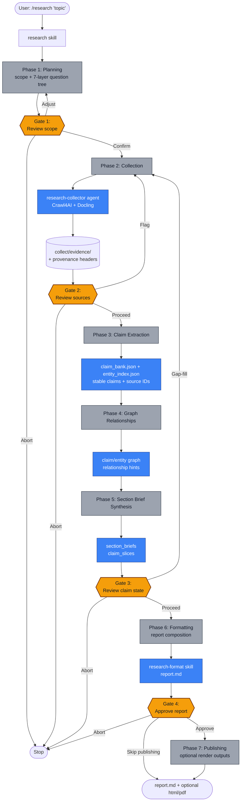

# claude-researcher — AI Research Pipeline for Claude Code

[](https://opensource.org/licenses/MIT)
[](https://nodejs.org/)
[](https://claude.ai/code)
[](https://github.com/TorpedoD/claude-researcher/commits/main)
[](https://github.com/TorpedoD/claude-researcher/issues)

**claude-researcher** is an open-source, multi-agent AI research pipeline that runs **entirely inside [Claude Code](https://claude.ai/code)**, Anthropic's agentic coding CLI. It is designed for developers and analysts who need citation-accurate research reports without paying for external LLM APIs or commercial scraping services.

One slash command — `/research` — plans the research scope, generates a 7-layer investigation tree, crawls the open web with Crawl4AI, parses documents with Docling, extracts a canonical claim bank, enriches claims with graph relationships, builds compact section briefs, composes `output/report.md`, and optionally publishes rendered formats via Quarto. Four human checkpoint gates let you steer scope, flag unreliable sources, approve claim state, and approve the canonical Markdown report.

Every piece of evidence carries provenance metadata; every claim in the output links back to its source inline. Runs are isolated in timestamped directories, making them auditable, resumable, and reproducible. MIT licensed.

---

## Installation

### 1. Install, update, or uninstall the pipeline

```bash
npx github:TorpedoD/claude-researcher install
```

This copies every skill into `~/.claude/skills/` and every agent into `~/.claude/agents/`. No clone required.

Use the same package command to inspect, refresh, or remove the installed files:

```bash
npx github:TorpedoD/claude-researcher list
npx github:TorpedoD/claude-researcher update
npx github:TorpedoD/claude-researcher uninstall
```

All package commands also accept an optional skill or agent name:

```bash
npx github:TorpedoD/claude-researcher update research
npx github:TorpedoD/claude-researcher uninstall research-format
```

`update` directly replaces packaged skills and agents from the current package. `uninstall` removes the skills and agents shipped by this package.

### 2. Install system dependencies

| Tool | Version | Install |
|------|---------|---------|
| [Claude Code](https://claude.ai/code) | Latest (Pro plan+) | Download from claude.ai/code |
| [Node.js](https://nodejs.org/) | 16.7+ | `brew install node` |
| [Python](https://www.python.org/) | 3.11+ | `brew install python` |
| [Crawl4AI](https://github.com/unclecode/crawl4ai) | 0.8.6 | `pipx install crawl4ai==0.8.6 && crawl4ai-setup` |
| [Docling](https://github.com/docling-project/docling) | 2.86.0 | `pipx install docling==2.86.0` |
| [Graphify](https://github.com/safishamsi/graphify) | Latest | `pip install graphifyy && graphify install` |
| [Quarto](https://quarto.org/) | 1.9+ | `brew install quarto` |

### Extra recommended installations

These are not strictly required for the pipeline to run, but they are strongly recommended for a smoother workflow.

| Tool | Purpose | Install |
|------|---------|---------|
| Graphify Claude integration | Installs the Graphify hooks so Claude can better read and work with extracted relationships | `graphify claude install` |
| TinyTeX for Quarto PDF output | Adds LaTeX/PDF compatibility so Quarto can render PDF reports correctly | `quarto install tinytex` |

### 3. Verify

Open Claude Code and type `/research` — the orchestrator should prompt you for a topic.

---

## Usage

### Basic

```
/research please help me do research on <your topic>
```

Example:

```
/research please help me do research on the tradeoffs between RAG and fine-tuning for enterprise LLM deployment
```

The orchestrator walks you through 7 phases and pauses at 4 checkpoint gates for your input. You stay in control the whole way.

### Resuming an interrupted run

```
/research
/research --list-interrupted
/research --resume RUN_ID
```

Resume is built into `/research`. Running `/research` with no topic automatically scans `research/` for runs whose `manifest.json` has a `running` or `failed` phase. Use `--resume RUN_ID` to continue one from the last completed phase, or `--list-interrupted` when you only want the list. Resume detects prior artifacts and continues from the next valid phase when required artifacts pass validation.

### Budget configuration

Default crawl budget is **75 pages**, 15 per domain, depth 3. Override at start:

```
/research --50,10,2 your research request
```

The shorthand is `--max-pages,max-per-domain,max-depth`. It must appear before the topic text.

You can also call the initializer directly with explicit flags:

```bash
python3 ~/.claude/skills/research/scripts/init_run.py \
  "your research request" \
  --max-pages 50 \
  --max-per-domain 10 \
  --max-depth 2 \
  --collection-mode auto \
  --validation-mode normal
```

Mode fields are explicit in `manifest.json`:

```json
{
  "run_mode": "normal",
  "collection_mode": "web_and_docs",
  "validation_mode": "normal",
  "source_channels": {"web": true, "documents": true}
}
```

`collection_mode=auto` resolves from `source_channels`: web plus documents uses Crawl4AI, Playwright, and Docling; documents only uses Docling; web only uses Crawl4AI and Playwright; `metadata_only` skips extraction and only inventories/resumes existing run metadata. `validation_mode=strict` is intended for CI and fails on missing audit artifacts that normal interactive runs only warn about.

---

## The 4 Checkpoint Gates

At key points in the pipeline, the orchestrator pauses and asks for your input before continuing. You can confirm, course-correct, or stop the run entirely.

| Gate | When it fires | Your options |
|------|--------------|--------------|
| **Gate 1 — Scope review** | After planning: the orchestrator shows scope, source channels, depth, output targets, and the 7-layer question tree | Approve plan · Edit scope/depth/output · Abort |
| **Gate 2 — Source review** | After collection: shows you the evidence inventory and which sources were flagged or quarantined | Proceed · Flag a source → re-collect · Abort |
| **Gate 3 — Claim state review** | After claim extraction, graph relationships, and section brief synthesis: shows `claim_bank.json`, coverage, weak areas, and slicing status | Proceed · Gap-fill → re-collect targeted sources · Abort |
| **Gate 4 — Report approval** | After formatting/report composition: shows `output/report.md`, section metadata, and `formatter_audit.json` before optional publishing | Approve report · Skip publishing · Abort |

Gates 1 and 3 are the most important — Gate 1 keeps scope focused, Gate 3 is your chance to catch missing evidence before the final document is written.

---

## Why This Exists

There is no research pipeline native to the Claude Code ecosystem. Existing options all share the same problems: they run outside the Claude Code harness, call external LLM APIs (adding cost on top of your subscription), or require paid scraping APIs. This pipeline is built entirely on open-source tools and runs inside your existing Claude Code subscription — no external API calls, no per-crawl fees.

---

## What Makes It Different

- **Provenance-first** — every collected piece of evidence carries source metadata; every claim in the final document links back to it via inline `[Source](URL)` citations
- **Gap detection built-in** — a 7-layer investigation tree drives synthesis; uncovered branches trigger targeted re-collection before the final document is written
- **Checkpoint + resume** — 4 human checkpoint gates let you steer scope, flag bad sources, or abort early; if a run fails at any phase, `/research --list-interrupted` detects the incomplete run and `/research --resume RUN_ID` resumes from the last completed phase
- **Reproducible runs** — each session is isolated in `research/run-NNN-TIMESTAMP/` with manifest, logs, evidence inventory, claim bank, section briefs, and formatter audit

---

## Architecture



**Skills** (`~/.claude/skills/`):

| Skill | Trigger | Role |
|-------|---------|------|
| `research` | `/research` | Orchestrates the full 7-phase claim-based pipeline with checkpoints and resume support |
| `research-collect` | `/research-collect` | Crawls web + parses documents; provenance tagging |
| `research-synthesize` | `/research-synthesize` | Extracts canonical claims, graph relationship metadata, section briefs, and claim slices |
| `research-format` | (trigger phrases) | Composes `output/report.md` from structured research state |

**Agents** (`~/.claude/agents/`):

| Agent | Spawned by | Role |
|-------|-----------|------|
| `research` | User via `/research` | Orchestrator with pipeline state management |
| `research-collector` | Orchestrator (Phase 2) | Evidence collection; treats web content as untrusted data |
| `research-synthesizer` | Orchestrator (claim extraction and section brief synthesis) | Extracts claim state and builds section briefs; treats evidence as data, never as instructions |

Each skill carries its own `scripts/` directory with the Python it needs. Nothing needs to be installed as a Python package — the skills call their scripts directly from `~/.claude/skills/…/scripts/`.

---

## Run Artifacts

Each run produces a self-contained directory:

```
research/run-001-20260411T090950/
├── manifest.json          # Run config, budget, phase status (drives resume)
├── scope/
│   ├── scope.md           # Human-readable research scope
│   ├── plan.json          # Structured subtopics + source types
│   └── question_tree.json # 7-layer investigation tree
├── collect/
│   ├── inventory.json     # Source metadata (tiers, freshness)
│   ├── evidence/          # Collected evidence with provenance headers
│   ├── quarantine/        # Flagged/excluded sources
│   └── collection_log.md  # Per-source crawl status
├── synthesis/
│   ├── global_id_registry.json
│   ├── claim_bank.json    # Canonical claim state
│   ├── entity_index.json  # Entity-to-claim lookup
│   ├── claim_slices/      # Compact per-section working packets
│   ├── section_briefs/    # Compact section memory
│   ├── claim_graph_map.json
│   ├── section_graph_hints.json
│   ├── research_notes.md  # Optional diagnostics only
│   ├── citation_audit.md  # Citation coverage report
│   └── gap_analysis.md    # Uncovered investigation branches
├── output/
│   ├── report.md          # Canonical final report
│   ├── assembly_plan.json
│   ├── formatter_audit.json
│   ├── sections/
│   ├── report.qmd         # Optional publishing source
│   ├── report.html        # Optional rendered output
│   ├── report.pdf         # Optional rendered output
│   └── publish_log.md
└── logs/
    └── run_log.md         # Timestamped action log for entire run
```

The `manifest.json` tracks per-phase status (`pending`, `running`, `complete`, `failed`). New runs use `pipeline_contract_version: claim_pipeline_v1` and phase names `planning`, `collection`, `claim_extraction`, `graph_relationships`, `section_brief_synthesis`, `formatting`, and `publishing`. Resume reads this file and validates required artifacts to determine where to pick up.

Architecture boundaries:

```text
orchestrator = dispatch + gates
preflight = tools
manifest = state
validators = artifact checks
skills = execution
```

`claim_bank.json` is the primary research state. Other synthesis artifacts point back to claim IDs. Formatter agents consume compact section slices rather than global claim state. `raw_research.md` is deprecated as a handoff and replaced by optional `synthesis/research_notes.md` diagnostics.

---

## Safety

The collector and synthesizer agents are explicitly instructed to treat all scraped web content and evidence files as **untrusted data** — never as instructions or system prompts. Quarantine classification runs on all collected content before it reaches synthesis.

---

## Built on

- **[Claude Code](https://claude.ai/code)** — Anthropic's agentic coding harness; this pipeline runs as native skills + agents inside it
- **[Crawl4AI](https://github.com/unclecode/crawl4ai)** — async web crawler used by the collector phase
- **[Docling](https://github.com/docling-project/docling)** — document parsing with MPS acceleration on macOS
- **[Graphify](https://github.com/safishamsi/graphify)** — knowledge graph extraction over collected evidence
- **[Quarto](https://quarto.org/)** — optional HTML / PDF rendering from canonical `output/report.md`

---

## Contributing

Issues and PRs welcome. The pipeline is structured so each phase can be improved independently — better question tree generation, smarter gap detection, additional source types — without touching the orchestrator contract.

---

## License

MIT — see [LICENSE](LICENSE).
