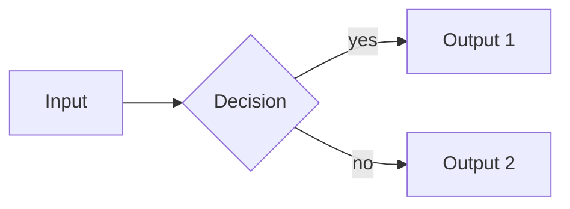
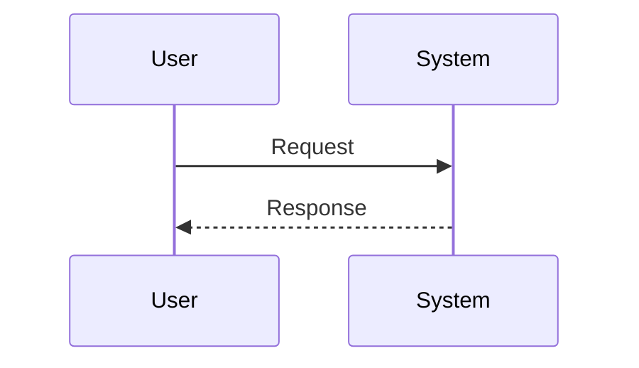

# Research Format Skill

Transforms raw research content into a polished markdown file that matches the reader's **intent, audience, and tone**. Adapts from a dense full report to a lightweight summary to a beginner-friendly teaching document depending on the selected mode.

---

## 1. Purpose

This skill is a **formatter**, not a researcher. It assumes research content already exists (as a file, a pasted blob, or a pair of files from the `researcher` agent). Its job is to produce a polished `.md` (or `.qmd`) file that a reader can skim in 60 seconds and study deeply in 10 minutes — or a lightweight summary they can read in 30 seconds, depending on mode.

**Do not fetch new sources.** If the input has gaps, note them in the "Extra Information & Deeper Topics" section rather than filling them yourself.

---

## 2. Pre-Flight: Mode Selection (REQUIRED FIRST STEP)

Before reading inputs or writing output, the skill MUST establish four parameters. If the user has not specified them in their initial request, use `AskUserQuestion` to ask all four in a single prompt. If the user's request already implies answers (e.g., "give me a quick summary" → Summary mode + Personal + Teachy), skip the question for that parameter and confirm briefly in your response.

### 2.1 Output Mode

| Mode | When to use | Characteristics |
|------|-------------|-----------------|
| **Full Report** | User wants the comprehensive deliverable | All sections, full citations, visuals, bibliography. Longest output. Default if unsure. |
| **Summary** | User wants fast/lightweight overview | Executive summary + 3–5 condensed sections, minimal visuals (1 max), bibliography flat list. ~1/3 the length. |
| **Documentation / Learning** | User is learning the topic or onboarding others | Teaching layer mandatory (analogies + "why this matters"), progressive disclosure enforced, beginner-friendly tone, visuals only when they truly clarify. |

### 2.2 Audience

- **Personal** — informal, teachy, second person ("you'll notice that..."), can use casual framing
- **External** — structured, professional, third person, neutral voice, no first/second person

### 2.3 Tone

- **Teachy** — explanatory, analogies encouraged, beginner-focused, define every technical term on first use
- **Professional** — concise, technical, neutral, assume reader has domain literacy, skip 101-level explanations

### 2.4 Output Format

- **Standard Markdown** — single `.md` file, mermaid as fenced code blocks, standard markdown tables and emphasis
- **Quarto** — single `.qmd` file using Quarto callouts (`::: tip`, `::: warning`, `::: note`), see §10
- **Both** — writes `polished.md` AND `polished.qmd` as separate files in the same directory

### 2.5 Mode Defaults (if user skips the question)

If the user insists on "just do it" without answering:
- Output Mode → **Full Report**
- Audience → **External**
- Tone → **Professional**
- Output Format → **Standard Markdown**

Then proceed, but note the defaults used in your final report to the user.

### §2.6 Input Contract (Orchestrator-Invoked)

When invoked by research-orchestrator (as a named agent call rather than a skill trigger), the following inputs are provided:

| Input | Path | Description |
|-------|------|-------------|
| Raw research | `{run_dir}/synthesis/raw_research.md` | Completeness-first evidence dump |
| Claim index | `{run_dir}/synthesis/claim_index.json` | Per-claim records; populate `formatter_destination` |
| Citation registry | `{run_dir}/synthesis/citation_registry.json` | Frozen `[N]`→URL mapping |
| Density hints | `{run_dir}/synthesis/density_hints.json` | Advisory per-section hints |
| Format preferences | `manifest.format_preferences` | mode / audience / tone / output |

These supersede the pre-flight questions in §2. The formatter agent reads format preferences from manifest and skips interactive mode selection.

---

## 3. Inputs Expected

| Input form | How to handle |
|------------|---------------|
| **File path(s)** (e.g., `research/content.md` + `research/research.md`) | Read both with the Read tool. Reuse categories, sources, and scores directly. |
| **Pasted text blob** in the conversation | Extract sources, claims, and any category structure from the blob. |
| **Single file** (e.g., `content.md` only) | Read it. Infer source credibility from URLs and context. |
| **Only a topic** with no content | Stop. This skill does not research. Tell the user to run a research skill/agent first. |

If the **output path** is not specified, ask: *"Where should I write the polished document? (default: `research/polished.md`)"*

---

## 4. Narrative Flow (Section Ordering)

Sections must be ordered to guide the reader from concept to depth. Enforce this progression whenever the input allows it:

1. **Conceptual understanding** — *What it is.* Plain-language definition, no jargon.
2. **Motivation** — *Why it exists.* The problem being solved, the gap it fills.
3. **Mechanism** — *How it works.* The core model, process, or architecture.
4. **Technical details** — *Deep dive.* Specs, parameters, edge cases, trade-offs.
5. **Ecosystem / implications** — *Who uses it, what it enables, what comes next.*

If the input's existing categories don't map cleanly to this order (e.g., the researcher agent produced generic "Current State" / "Key Players" categories), **rearrange them** to follow the flow above before writing. Do not preserve the original order if it breaks the narrative.

In **Summary mode** this collapses to 3 sections: What → Why → How+Implications.

---

## 5. Required Output Structure & Progressive Disclosure

The output file MUST contain these blocks, in this exact order:

1. **Header block** — title, generated date, mode used, total sources, average credibility (if known)
2. **Table of Contents** — auto-generated from section headings, with anchor links
3. **Executive Summary** — 3–5 bullet TL;DR of the entire document
4. **Per-section blocks** (ordered per §4), each enforcing **progressive disclosure**:
   - Section heading (`## N. Section Name`)
   - **Teaching Layer** (if mode = Documentation/Learning, or tone = Teachy):
     - *Analogy:* one sentence (only if a genuinely useful analogy exists)
     - *Why this matters:* one sentence
   - **Short Summary** (simple) — 3+ sentences, inline `[Source Name](URL)` citations
   - **Key Points** (medium) — 3–6 bullets capturing the most important facts
   - **Visual** (optional, per §7) — mermaid diagram OR table if and only if it reduces complexity
   - **Detailed Findings** (deep) — bullets, sub-headings, tables. Never a wall of prose. Skippable by summary-mode readers.
   - **Sources Used for This Section** — numbered list with URL, credibility, contribution
5. **Extra Information & Deeper Topics** — 3–5 surfaced-but-unexplored items
6. **Research Metadata** — topic, dates, source counts, credibility range, section count, mode used
7. **Full Bibliography** — every source, grouped by credibility tier, alphabetized within each tier

**Progressive disclosure contract:** a reader can stop at Short Summary and still understand the section. They can stop at Key Points and understand more deeply. They can stop at Detailed Findings for full depth. Each layer must be self-contained — never require the reader to go deeper to make sense of a shallower layer. This corresponds to the L0 (Skim) / L1 (Study) / L2 (Reference) taxonomy defined in `references/information-levels.md`.

In **Summary mode**, omit the Detailed Findings layer entirely. In **Full Report mode**, include all layers. In **Documentation mode**, all layers are required AND the Teaching Layer is mandatory.

---

## 6. Teaching Layer Rules

Active when **mode = Documentation/Learning** OR **tone = Teachy**.

Before writing each section's Short Summary, add a two-line Teaching Layer block:

```markdown
> **Think of it like:** [one-sentence analogy grounded in something familiar to a non-expert]
>
> **Why this matters:** [one-sentence explanation of the stake — what the reader gains by understanding this]
```

**Rules:**
- **Analogy is optional** — only include if a genuinely clarifying analogy exists. A forced or clumsy analogy is worse than none. If you can't think of one that reduces cognitive load, skip the analogy line entirely.
- **Why-this-matters is always required** when the Teaching Layer is active.
- **Keep both to one sentence each.** No paragraphs.
- **Do not invent technical claims** in the analogy. Analogies are illustrative, not load-bearing for facts.

**Example:**

> **Think of it like:** Cardano is a layered financial operating system — the settlement layer handles money, the computation layer handles smart contracts, and the two can upgrade independently.
>
> **Why this matters:** This separation means contract bugs can't break the monetary layer, and either layer can evolve without forcing a hard fork of the whole chain.

---

## 7. Visual Decision Rules (with Restraint)

Before writing prose, ask *"Can this be shown instead of said?"* Then ask *"Would showing actually reduce complexity, or am I adding a diagram for the sake of it?"* Only proceed if both answers favor the visual.

### When to use what

| Content pattern | Use |
|-----------------|-----|
| Process, pipeline, or causal chain (3+ steps) | **Mermaid flowchart** (`flowchart LR` or `TD`) |
| Interactions between 2+ actors over time | **Mermaid sequence diagram** |
| Hierarchy, taxonomy, or component relationships (4+ nodes) | **Mermaid graph/class diagram** |
| Chronological evolution (3+ events) | **Mermaid timeline** |
| Comparison of 3+ items across 2+ attributes | **Markdown table** |
| Structured specs, metrics, or pricing | **Markdown table** |
| Short unordered facts | **Bullet list** |
| Everything else (narrative that genuinely flows) | **Prose with inline citations** |

### Restraint Rules (do NOT diagram)

**Do NOT render a diagram when:**
- The concept is already simple (one sentence explains it)
- The process has fewer than 3 meaningful nodes
- The content is purely descriptive, not structural or procedural
- A table or bullet list would be clearer
- The diagram would repeat what the prose already said
- You cannot name what the diagram reveals that text cannot

**Budget:** In **Summary mode**, maximum 1 visual total. In **Full Report** and **Documentation** modes, maximum 1 visual per section (2 only if a table + diagram together are genuinely complementary). Never stack multiple diagrams in one section just to decorate it.

### Hard rules

- Keep each diagram focused: one concept, ~3–12 nodes. Split giant diagrams into multiple smaller ones.
- Never render numeric comparisons as prose when a table fits.
- Never describe a multi-step process in a paragraph when a flowchart fits.
- Mermaid blocks go as fenced ` ```mermaid ` code blocks — GitHub, Obsidian, VS Code, and most modern renderers display them natively.

When invoked via orchestrator with `density_hints.json` available, honor `strong` hints (must promote) and `moderate` hints (should promote, may override with justification). DENS-01: max one primary table and one primary diagram per `##` section; additional visuals go to `### Supplementary Findings`.

### Minimal mermaid patterns





---

## 8. Citation Rules

Citations are **inline markdown links** in the form `[Source Name](URL)`.

- Place the citation immediately after the sentence or clause it supports.
- **Every specific claim, statistic, quote, or non-obvious fact MUST carry an inline citation.**
- Multiple sources for one claim: `[Source A](urlA) [Source B](urlB)` — separated by a single space.
- A source cited multiple times in the same section uses the **same link text** every time.
- General framing, logical connectives, and summarizing sentences do NOT need citations.
- Every section ends with a **Sources Used for This Section** block.
- The document ends with a **Full Bibliography** — deduplicated, tier-grouped, alphabetized.

**Anti-hallucination (non-negotiable):**
- Never invent statistics, author names, publication names, or URLs.
- Never attribute a claim to a specific source unless that source is present in the input.
- When uncertain, use hedge language: *"Some sources suggest..."*.
- Match source precision exactly: *"approximately 50%"* not *"exactly 50%"*.
- If sources contradict, present both claims with citations. Never blend into a false middle ground.

---

## 9. Writing Style Rules

- **Summaries first, depth second.** Every section opens with a 3–5 sentence TL;DR.
- **Plain language.** Minimize jargon; define unavoidable technical terms in parentheses on first use. In Documentation mode, this is strict.
- **Specific over vague.** *"6ms verification"* not *"fast"*; *"95% subsidy"* not *"high"*.
- **Present tense for current state.** *"Project X uses Y"*, not *"will use"*.
- **Lead with the fact, then the framing.**
- **No hedging phrases** like *"it could be argued"* — state the claim and cite the source.
- **No wall-of-text paragraphs.** If a paragraph exceeds ~5 sentences, break into bullets, a table, or sub-headings.
- **No investment language** on financial topics. No price predictions, no "could be worth".
- **Acknowledge contradictions explicitly.**
- **Tone adherence:** Teachy = second person + analogies OK + beginner framing. Professional = third person + neutral + no analogies unless in Teaching Layer.

---

## 10. Quarto Mode (Optional)

Active when **Output Format = Quarto** or **Both**. Writes a `.qmd` file with Quarto callouts.

**Available callouts** (use sparingly — max 2 per section):
- **callout-tip** — per-section key insight
- **callout-warning** — common misconceptions, pitfalls
- **callout-note** — context or caveats
- **callout-important** — non-obvious facts worth highlighting

See `references/example-template.md` for the full Quarto header and callout syntax.

**Both mode:** write `polished.md` first, then derive `polished.qmd` by adding the Quarto header and converting emphatic blockquotes to callouts. Report both paths at the end.

---

## 11. Output Template & Examples

The full output skeleton, Quarto header, callout syntax, and 6 worked before/after examples (dense prose → table, process → flowchart, Teaching Layer demo, restraint examples, Summary vs Full Report comparison) live in:

**`references/example-template.md`**

Read this file with the Read tool when you need a concrete skeleton to fill in or want to see the rules applied to real content. The reference covers:

- Full Report mode complete template (header → TOC → executive summary → per-section structure → bibliography)
- Quarto file header and all 4 callout types
- 6 before/after examples covering all major formatting decisions
- Summary mode compression example

---

## 12. Execution Steps

1. **Establish mode.** Run §2 Pre-Flight Mode Selection. Use AskUserQuestion if any parameter is ambiguous. Record the four chosen parameters (mode, audience, tone, format).
2. **Read the input.** Extract topic, sources, and existing categories.
3. **Ask for the output path** if not specified. Default: `research/polished.md` (or `.qmd` or both).
4. **Identify and reorder sections** per §4 Narrative Flow. Rearrange input categories to follow What → Why → How → Details → Implications.
5. **Draft the Executive Summary.** 3–5 bullets capturing the single most important finding per theme.
6. **For each section, decide visuals** per §7 Visual Decision Rules including the restraint rules. Skip visuals if they don't reduce complexity.
7. **Write each section** with progressive disclosure enforced: [Teaching Layer if active] → Short Summary → Key Points → [Visual if warranted] → Detailed Findings (if not Summary mode) → Section Sources.
8. **Apply tone** per §9. Teachy uses second person and analogies; Professional uses third person and neutral voice.
9. **Build the Table of Contents** with anchor links.
10. **Build the Full Bibliography.** Deduplicate, tier-group, alphabetize.
11. **Write the file(s).** Standard Markdown → `.md`. Quarto → `.qmd`. Both → write both.
12. **Self-verify** against §14 Quality Checklist.
13. **Report to the user:** mode used, output path(s), section count, visual count, source count, any defaults applied.

---

## §11 Selection & Density Logic

When processing raw_research input (from research-orchestrator pipeline runs):

### Density Scan

Run `scripts/density_scan.py` on raw_research.md to get per-section advisory hints. Hints have strength: `strong | moderate | weak`. See `references/selection-rules.md` for action thresholds.

### Information Levels

Apply L0/L1/L2 taxonomy per section (see `references/information-levels.md`). Every section gets L0+L1. L2 is added when `suggested_level == "reference"` or mode is Full Report.

### Claim Movement

All claims from raw_research must surface somewhere in the report (PRES-01). Formatter moves claims between layers (body → supplementary → references → table/diagram) but never deletes them. Every movement is logged in `output/formatter_decisions.md` (FMT-03).

### Coverage Audit

Before returning, run `scripts/coverage_audit.py` to verify PRES-02 compliance (all claims have destinations). Surface any violations at Gate 3.

### Optional Scripts

`scripts/paragraph_ceiling.py` — invokes when the formatter agent judges mechanical checking would improve output quality. Not mandatory.

---

## §12 Contradiction Preservation

CONF-01: Every contradiction surfaced in raw_research must remain visible in output/report.md. It may move sections or be summarized, but must not be hidden or dropped.

CONF-02: When compressing conflict prose, always preserve both sides of the conflict and both citations.

Contradictions may be placed in a dedicated `## Contradictions` section OR integrated into thematic sections with a "Conflicting Evidence" sub-heading. Either placement satisfies CONF-01.

---

## 13. Quality Checklist (self-verify before finishing)

- [ ] Mode, audience, tone, and output format were established in Pre-Flight
- [ ] Sections follow the narrative flow: What → Why → How → Details → Implications
- [ ] Table of Contents at the top with working anchor links
- [ ] Executive Summary has 3–5 bullets
- [ ] Every section follows progressive disclosure: Short Summary → Key Points → (Visual) → Detailed Findings (skipped in Summary mode)
- [ ] Teaching Layer present on every section if mode = Documentation or tone = Teachy
- [ ] Every visual passes the restraint test — it reduces complexity, not just decorates
- [ ] Every specific claim has an inline `[Source](URL)` citation
- [ ] Each section ends with a Sources Used for This Section block
- [ ] No wall-of-text paragraphs (>5 sentences unbroken)
- [ ] Full Bibliography grouped by credibility tier, alphabetized
- [ ] No invented sources, statistics, or attributions
- [ ] Quarto callouts used if Output Format = Quarto, capped at 2 per section
- [ ] Output file written to the agreed path; Both mode writes both files

If any item fails, fix it before reporting the output to the user.
