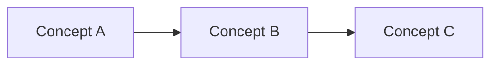
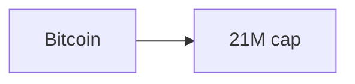

# Research Format — Full Output Template & Examples

This file contains the full output template and worked before/after examples referenced from `SKILL.md`. Load this when you need a concrete skeleton to fill in, or when you want to see how the rules translate to real output.

---

## Full Report Mode — Complete Template

Use this skeleton for **Full Report mode**. For **Summary mode**, drop the Detailed Findings layer and keep Key Points as the main depth. For **Documentation mode**, the Teaching Layer block is mandatory on every section.

````markdown
# [Topic]: Research Report

Generated: [YYYY-MM-DD]
Mode: [Full Report | Summary | Documentation]
Audience: [Personal | External]
Tone: [Teachy | Professional]
Total Sources: [N]
Average Credibility: [X.X]/100

---

## Table of Contents

1. [Executive Summary](#executive-summary)
2. [Section One Name](#1-section-one-name)
3. [Section Two Name](#2-section-two-name)
...
N. [Extra Information & Deeper Topics](#extra-information--deeper-topics)
N+1. [Research Metadata](#research-metadata)
N+2. [Full Bibliography](#full-bibliography)

---

## Executive Summary

- **[Key finding 1]** — [one sentence with inline citation if applicable]
- **[Key finding 2]** — [one sentence]
- **[Key finding 3]** — [one sentence]
- **[Key finding 4]** — [one sentence]
- **[Key finding 5]** — [one sentence]

---

## 1. [Section Name — follows narrative order: What → Why → How → Details → Implications]

> **Think of it like:** [analogy — only if Teaching Layer is active and a good analogy exists]
>
> **Why this matters:** [one sentence — only if Teaching Layer is active]

### Short Summary

[3+ sentence summary with inline [Source Name](URL) citations for every specific claim.
Lead with the key fact. Plain language. No jargon walls.]

### Key Points

- [Medium-depth fact with inline citation [Source](URL)]
- [Medium-depth fact with inline citation [Source](URL)]
- [Medium-depth fact with inline citation [Source](URL)]

### Visual (only if it reduces complexity)



*Or, if the content is comparative:*

| Attribute | Option A | Option B | Option C |
|-----------|----------|----------|----------|
| **Metric 1** | value | value | value |
| **Metric 2** | value | value | value |

### Detailed Findings

#### [Sub-question or sub-topic]

[2–3 sentences with citations.]

#### [Another sub-topic]

[More depth, always cited.]

### Sources Used for This Section

1. **[Source Title]**
   - URL: [full URL]
   - Credibility: [score]/100 (if known)
   - Contribution: [1–2 sentences — what this source provided for this section specifically]

2. **[Next source]**
   - URL: [full URL]
   - Credibility: [score]/100
   - Contribution: [description]

---

## 2. [Next Section Name]

[Repeat the same structure.]

---

## Extra Information & Deeper Topics

Areas that surfaced during research but were not fully explored in the source material:

- **[Topic 1]** — [what could be explored further]
- **[Topic 2]** — [what questions arose]
- **[Topic 3]** — [related area worth investigating]

---

## Research Metadata

- **Topic:** [topic]
- **Generated:** [YYYY-MM-DD]
- **Updated:** [YYYY-MM-DD]
- **Mode:** [mode used]
- **Audience:** [audience]
- **Tone:** [tone]
- **Total Sources:** [N]
- **Removed Sources:** [M] (if known from input)
- **Average Credibility:** [X.X]/100
- **Credibility Range:** [min] – [max]
- **Section Count:** [K]

---

## Full Bibliography

All sources referenced in this document, grouped by credibility tier and alphabetized within each tier.

### Highly Credible (80–100)

- **[Source Name]** — [URL] — [score]/100
- **[Source Name]** — [URL] — [score]/100

### Moderately Credible (60–79)

- **[Source Name]** — [URL] — [score]/100

### Low Credibility (50–59)

- **[Source Name]** — [URL] — [score]/100

### Unscored

*Sources from the input that had no credibility score assigned.*

- **[Source Name]** — [URL]
````

---

## Quarto Mode — Header & Callouts

When **Output Format = Quarto**, write a `.qmd` file with this header:

```markdown
---
title: "[Topic]: Research Report"
date: "[YYYY-MM-DD]"
format:
  html:
    toc: true
    toc-depth: 3
    number-sections: true
---
```

Replace emphatic blockquotes with Quarto callouts:

```markdown
::: {.callout-tip title="Key Insight"}
[The single most important takeaway of this section in 1–2 sentences.]
:::

::: {.callout-note title="Context"}
[Background the reader may need but that isn't load-bearing.]
:::

::: {.callout-warning title="Common Misconception"}
[A mistake readers commonly make, and the correction.]
:::

::: {.callout-important title="Non-Obvious Fact"}
[A surprising or counterintuitive fact worth highlighting.]
:::
```

**Callout budget:** maximum 2 per section. Callouts lose power if every paragraph is boxed.

---

## Before/After Examples

### Example A — Dense prose → Summary + table (Professional tone)

**Before:**
> Ethereum's rollups come in two main flavors. Optimistic rollups like Arbitrum and Optimism assume transactions are valid and allow a 7-day challenge window for fraud proofs. ZK rollups like zkSync and StarkNet use validity proofs that are verified immediately on-chain, allowing faster finality but with higher computational cost for proof generation.

**After:**

> Ethereum rollups split into two families based on how they prove correctness: **optimistic** (assume valid, challenge later) and **ZK** (prove valid immediately) [L2Beat](https://l2beat.com).

| Rollup type | Proof method | Finality | Example projects |
|-------------|-------------|----------|------------------|
| **Optimistic** | Fraud proofs, 7-day challenge window | ~7 days | Arbitrum, Optimism |
| **ZK** | Validity proofs, verified on-chain | Minutes | zkSync, StarkNet |

---

### Example B — Process described in text → Mermaid flowchart

**Before:**
> A transaction is first submitted to the mempool, then picked up by a validator, included in a block, propagated across the network, and finally finalized once enough attestations are received.

**After:**

> A transaction moves through five stages from submission to finality [Ethereum docs](https://ethereum.org/developers).


*(5 nodes exceeds the 3-node restraint threshold and the flow is genuinely procedural — diagram justified.)*

---

### Example C — Teachy tone with Teaching Layer

**Before (Professional tone, no Teaching Layer):**
> Cardano uses a layered architecture separating settlement from computation.

**After (Teachy tone, Teaching Layer active):**

> **Think of it like:** a building where the ground floor handles cash and the upper floor handles contracts — you can renovate one floor without evicting everyone on the other.
>
> **Why this matters:** smart contract bugs can't break the monetary layer, and either layer can evolve without forcing a hard fork of the whole chain.
>
> Cardano separates its **settlement layer** (handles ADA transfers) from its **computation layer** (handles smart contracts) [Cardano docs](https://docs.cardano.org). This is unusual among blockchains, most of which bundle both into one execution environment.

---

### Example D — Plain URL dump → Proper section sources block

**Before:**
> Sources: https://a.com, https://b.org, https://c.edu

**After:**

> ### Sources Used for This Section
>
> 1. **A Site**
>    - URL: https://a.com
>    - Credibility: 72/100
>    - Contribution: Provided the core definition and historical context.
>
> 2. **B Org**
>    - URL: https://b.org
>    - Credibility: 88/100
>    - Contribution: Supplied the quantitative metrics cited in the summary.
>
> 3. **C University**
>    - URL: https://c.edu
>    - Credibility: 91/100
>    - Contribution: Peer-reviewed research paper backing the technical claims.

---

### Example E — Diagram restraint (DO NOT diagram)

**Input:** "Bitcoin has a fixed supply cap of 21 million coins."

**Wrong (overuse — single fact does not need a flowchart):**


**Right:** Just write the sentence. One fact is not a diagram.

---

### Example F — Summary mode vs Full Report mode

**Same input, different modes:**

**Full Report mode** — complete section with Short Summary → Key Points → Visual → Detailed Findings → Sources.

**Summary mode** — compress to:
> ## Rollups
>
> Ethereum rollups split into **optimistic** (fraud proofs, 7-day challenge) and **ZK** (validity proofs, minutes to finality) [L2Beat](https://l2beat.com). Optimistic dominates TVL today; ZK rolls are catching up on throughput.
>
> - Arbitrum and Optimism lead optimistic rollups by TVL
> - zkSync and StarkNet lead ZK rollups by transaction volume
>
> **Sources:** [L2Beat](https://l2beat.com), [Ethereum docs](https://ethereum.org)

No Detailed Findings, no per-section sources block, single inline source line at the end.

---

## Example: L0/L1/L2 Information Levels

The following shows how a dense raw_research section gets formatted into the three information levels.

### Raw Research Input (completeness-first)

```
## Consensus Mechanisms

Central concept: **Raft Consensus**.

### Definition / identity
Raft is a consensus algorithm designed to be more understandable than Paxos [1](url1). It decomposes consensus into three subproblems: leader election, log replication, and safety [1](url1). Introduced by Ongaro and Ousterhout at USENIX ATC 2014 [2](url2). Version used in etcd 3.x and CockroachDB [3](url3).

### Mechanism / process
Leader election uses randomized timeouts (150–300 ms default) to prevent split votes [1](url1). Candidates request votes from all peers [1](url1). A node wins when it receives votes from a majority [2](url2). Log replication: leader appends entry, sends AppendEntries RPC to all followers [1](url1). Entry committed when majority acknowledge [1](url1). Followers apply committed entries to state machine [3](url3).

### Data / versions / numbers
Default election timeout: 150–300 ms [1](url1). etcd production recommendation: 500 ms–2 s for LAN [3](url3). Edge deployment recommendation: 750 ms–5 s for high-latency links [4](url4). Heartbeat interval: 1/10th of election timeout [1](url1). Log entries include term number, index, command [2](url2).

### Comparisons
Raft vs Paxos: Raft assigns strict leader role, Paxos allows any node to propose [2](url2). Raft is considered 2.1× easier to implement than Paxos by Ongaro's study [2](url2). etcd uses Raft; ZooKeeper uses ZAB (Raft-like) [3](url3).

### Implications / tradeoffs
Strong consistency at the cost of availability during leader failure (~election timeout) [1](url1). Leader bottleneck under high write load [4](url4). Pipeline replication reduces latency by 40% in production [3](url3).
```

### Formatted Output (Full Report mode, external audience)

```markdown
## Consensus Mechanisms

**Raft achieves distributed consensus through leader-based log replication, offering strong consistency at the cost of brief unavailability during leader failure.**

### Short Summary

Raft decomposes consensus into leader election, log replication, and safety guarantees. A leader is elected via randomized timeouts to prevent split votes, then replicates log entries to followers, committing only when a majority acknowledges. Raft's strict leader model simplifies implementation compared to Paxos at the cost of a write-throughput bottleneck.

### Key Points

- Default election timeout: 150–300 ms; etcd production recommendation: 500 ms–2 s [1](url1)
- A candidate wins election on majority vote; commits require majority acknowledgment [1](url1)
- Raft is 2.1× easier to implement than Paxos by Ongaro's study [2](url2)
- Leader bottleneck under high write load; pipelining reduces latency by ~40% [3](url3)
- Edge deployments recommend 750 ms–5 s election timeout for high-latency links [4](url4)

### Consensus Algorithm Comparison (L2 — prompted by strong table hint)

| Property | Raft | Paxos | ZAB (ZooKeeper) |
|----------|------|-------|-----------------|
| Proposer | Leader only | Any node | Leader only |
| Understandability | High (by design) | Low | Medium |
| Used in | etcd, CockroachDB | Google Chubby | ZooKeeper |
| Election timeout (LAN) | 150–300 ms | varies | N/A |

[1](url1) [2](url2) [3](url3)

### Detailed Findings (L2)

Raft was introduced by Ongaro and Ousterhout at USENIX ATC 2014 as an alternative to Paxos designed for understandability [2](url2). It is used in etcd 3.x and CockroachDB [3](url3). The heartbeat interval is 1/10th of the election timeout [1](url1). Log entries contain term number, index, and command [2](url2). Pipeline replication in production reduces latency by approximately 40% [3](url3).

### Section References

[1](url1) — etcd Documentation
[2](url2) — In Search of an Understandable Consensus Algorithm (Ongaro)
[3](url3) — CockroachDB Architecture Guide
[4](url4) — Edge Consensus Deployment Guide
```

**Formatting decisions made:**
- Numeric comparisons (5 timeout values across 3 systems) → `strong` table hint honored → produced comparison table
- All 5 Key Points surfaced in L1 with citations
- Preamble (bold sentence) = L0
- Detailed findings (term numbers, heartbeat ratio, pipeline %) = L2
- No claims dropped; all citations preserved
