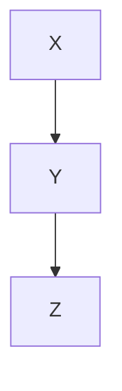

# Test Fixture — MERM-01 over limit

## Section with Oversized Mermaid

This section has a mermaid diagram with 16 nodes.

<!-- mermaid: 16 nodes -->

## Section with Missing Comment

This section has a mermaid diagram with no preceding node count comment.

