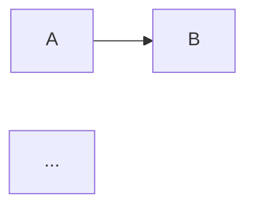

# Output Quality Specification

**Purpose:** Authoritative reference for the research synthesizer's output quality behavior. The synthesizer reads this file before writing `synthesis/raw_research.md` and applies its rules throughout synthesis.

**Consumers:** research-synthesize SKILL.md (via directive at top of skill); `check_content_rules.py` (MERM-01 comment hook).

## Document Structure

Every `synthesis/raw_research.md` document MUST open with this header in this exact order (D-01):

1. `# [Research Title]` — single H1; title reflects user_request
2. `## Summary` — 3–5 substantive sentences that allow a reader to grasp the core idea and purpose of the document before engaging with detailed sections. NOT a bullet list. NOT a teaser. NOT a rehash of the title. (D-02)
3. `## Table of Contents` — anchor links to every `##` and `###` heading in the document. Generated LAST (after the body is written) and inserted at this position. Anchors follow lowercase-hyphenated convention with leading numbering (`1.`, `2)`) and punctuation stripped. Example: `## 2. Architecture` → anchor `#architecture`. (D-03)
4. Body sections (per Section Ordering in research-synthesize SKILL.md)
5. `## Related Topics and Further Exploration` — concepts connected to the main topic but outside defined scope. When writing, if a concept branches too far from the main focus, STOP expanding it in place and move it here immediately. (D-04)
6. `## Sources` — global numbered list of every referenced source in number order. Format: `[N] Source Name — URL — Tier N — Freshness score`. Replaces the old `## Bibliography` section. (D-05, D-18)

### TOC two-pass workflow (REQUIRED)

The TOC is generated in two passes:

1. **Pass 1 — Write body:** write all sections including Related Topics and Sources, but leave a TOC placeholder (`## Table of Contents\n\n<!-- TOC generated in pass 2 -->\n`) at position 3.
2. **Pass 2 — Generate TOC:** after body is complete, extract every `##` and `###` heading in order, compute each anchor as `lowercase, hyphens, strip leading "N.", "N)", punctuation`, and replace the placeholder with the rendered TOC. Format:
   ```markdown
   - [Section Name](#section-name)
     - [Subsection Name](#subsection-name)
   ```
Never attempt to write the TOC inline during pass 1 — it will be incomplete.

## Per-Section Depth System

**Depth is assigned at Gate 1, not during writing. Once approved, depth is LOCKED.** (D-06)

### Depth Levels

- **Low** — High-level overview. Introduces the concept, explains what it is and how it broadly connects to other components. Does NOT unpack internal mechanisms or edge cases. Accurate and structured; reader understands role but not inner workings. (D-10)
- **Medium (default)** — Complete practical understanding. Every subsection MUST fully explain: (1) what the concept is, (2) how it operates, (3) why it exists / what problem it solves, (4) how it connects to other components. All meaningful aspects covered — structural connections, functional interactions, dependencies. Reader must not need external sources after reading a Medium-detail section. Missing key details is NOT acceptable. (D-11)
- **High** — Beyond practical understanding. Adds: implementation details, edge cases, alternative approaches, deeper internal mechanics that are not strictly required for general understanding but valuable for advanced readers. Only used when explicitly required or when a subsection represents a critical area where deeper insight significantly improves comprehension. (D-12)

### The Define → How → Why → Connects Pattern

Every subsection at every depth level follows the same four-part pattern: **define → how it operates → why it exists → how it connects to other components**. (D-13)

- At Low depth: apply the pattern briefly (1–2 sentences per part).
- At Medium depth: apply the pattern completely (1–2 paragraphs per part or equivalent structured content).
- At High depth: apply the pattern exhaustively (multiple paragraphs, tables, diagrams per part as needed).

### Locking and Expansion

- Depth assignments are READ from `scope/plan.json` → `section_depths[]` at synthesizer spawn time (D-09).
- Depth may be EXPANDED upward during writing if the synthesizer determines additional detail is required for completeness. Downgrading during writing is FORBIDDEN. (D-06)

### Readability is Structural, Not Reductive (D-14)

Detail must NEVER be omitted for clarity. Instead, RESTRUCTURE:
- Break into sub-sections
- Convert prose to a table (HIER-01 rules still apply)
- Add a diagram (HIER-02 / Mermaid rules still apply)

Guiding principle: **clarity comes from organization, not omission.**

## Citation Numbering (Global [N](URL) system)

**BREAKING CHANGE from prior `[Source Name](URL)` format.** (D-15)

### Format

Every factual claim cites inline as `[N](source_url)` where N is a monotonically incrementing integer assigned on first use of each unique URL. (D-15)

**Correct:**
> Raft uses a randomized election timeout to prevent split votes [1](https://example.com/docs/raft).

**Wrong (old format, REMOVED):**
> Raft uses a randomized election timeout to prevent split votes [etcd Documentation](https://example.com/docs/raft).

### Global Consistency

Numbers are GLOBAL and consistent throughout the document. The same source URL always receives the same number on every reference. (D-16)

While writing, maintain a citation registry `{url → number}`:
- First occurrence of a URL → assign next available integer, add to registry
- Subsequent occurrences of the same URL → reuse the existing integer
- Compare URLs after normalization (trailing slash stripped, canonical scheme) to avoid duplicate numbers for the same source

### Section References Block (after every ##)

After the body of each `##` section (excluding the document header H2s: `Summary`, `Table of Contents`, and the final `Sources`), append a `### Section References` block listing only the sources cited within that section, in global number order. Numbers remain global — do NOT restart numbering per section. (D-17)

Format:
```markdown
### Section References
[1](https://example.com) — Source Name
[4](https://other.com) — Other Source
```

One source per line. No leading dash/bullet. Global number, URL, em-dash, source name.

### Sources Section (final)

The document ends with `## Sources` — every referenced source in global number order. (D-05, D-18) Format:

```markdown
## Sources

[1] Source Name — https://example.com — Tier 1 — Freshness 0.95
[2] Other Source — https://other.com — Tier 2 — Freshness 0.80
```

Replaces the legacy `## Bibliography` table-format section.

### Citation Registry Artifact

After synthesis completes, serialize the `{url → number}` registry to `synthesis/citation_registry.json` with this shape (D-19):

```json
{
  "1": { "url": "https://example.com", "name": "Source Name", "tier": 1, "freshness_score": 0.95 },
  "2": { "url": "https://other.com",   "name": "Other Source", "tier": 2, "freshness_score": 0.80 }
}
```

Keys are the global citation numbers as strings. Values carry source metadata read from `collect/inventory.json`.

## Mermaid Diagram Constraints

Mermaid blocks are subject to node/edge caps to prevent PDF truncation. (D-23)

- **Flow diagrams** (`flowchart`, `graph LR/TD`): MAX 15 nodes.
- **Graph diagrams** (relationship/network): MAX 20 edges.
- If a diagram would exceed these limits: split into multiple smaller focused diagrams OR use structured textual explanation (nested lists, tables) instead.

### Node Count Comment (REQUIRED)

Every Mermaid block MUST be preceded by a comment on the immediately-prior line declaring the node count (D-24):

```markdown
<!-- mermaid: 12 nodes -->

```

This comment is read by `check_content_rules.py` (MERM-01 rule). A Mermaid block without a preceding `<!-- mermaid: N nodes -->` comment, or a comment declaring more than 15 nodes (flow) / 20 edges (graph), is flagged as a warn-level violation.

## Page Break Injection (PDF output)

When writing `synthesis/raw_research.md`, inject the Quarto shortcode `` on its own line BEFORE each top-level `##` section (except the first `## Summary`). (D-26)

Use the shortcode form `` — NOT the raw LaTeX block form `{=latex}\n\\newpage\n`. The shortcode is format-agnostic: Quarto renders it to `\newpage` in PDF and to an HTML no-op when rendering HTML. The synthesizer always injects it; the output format selection at Gate 3 determines whether the page breaks matter.

## Readability Rules (Cross-reference)

These apply across all depth levels, per research-synthesize SKILL.md § Readability Rules (HIER-04):

- Paragraphs ≤ 5 sentences
- Header hierarchy: ##, ###, ####. Never skip a level.
- No orphan paragraphs (single sentence on its own line)
- Code blocks MUST have a language annotation
